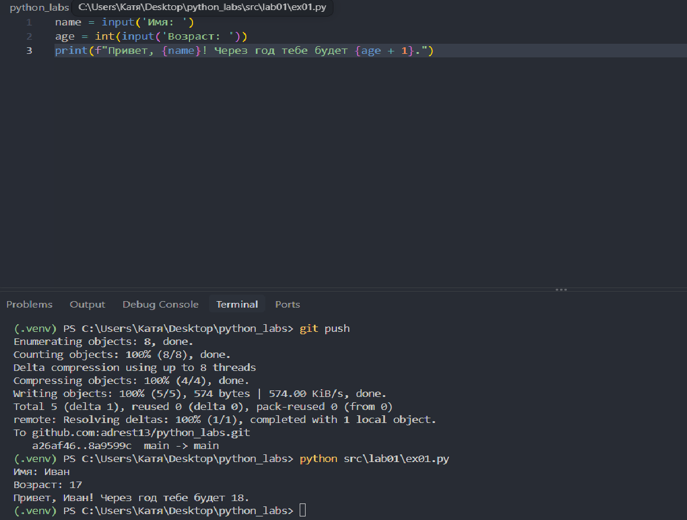
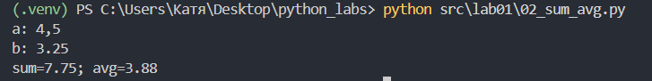
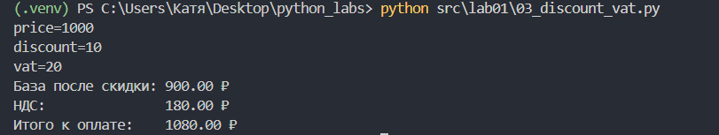
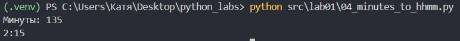
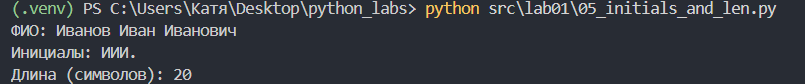
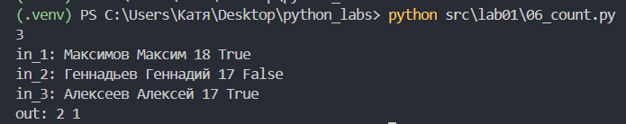
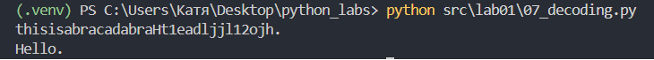

## ЛР1 — Ввод/вывод и форматирование

### Задание 1
Программа выводит имя и возраст
```py
name = input('Имя: ')
age = int(input('Возраст: '))
print(f"Привет, {name}! Через год тебе будет {age + 1}.")
```

<br>
*Результат выполнения скрипта 01_greeting.py (Привет и возраст)*

### Задание 2
На вход подаются 2 числа. Программа выводит их сумму и среднее арифметическое
```py
a = input("a: ")
b = input("b: ")

a = float(a.replace(',', '.'))
b = float(b.replace(',', '.'))

s = a + b
avg = s / 2

print(f"sum={s:.2f}; avg={avg:.2f}")
```

<br>
*Результат выполнения скрипта 02_sum_avg.py (Сумма и среднее)*

### Задание 3
Расчет 3 значений: база после скидки, НДС и итоговое значение. Числа округяются до 2 знаков после запятой
```py
price = float(input("price="))
discount = float(input("discount="))
vat = float(input("vat="))

base = price * (1 - discount/100)
vat_amount = base * (vat/100)
total = base + vat_amount

print(f"База после скидки: {base:.2f} ₽", f"НДС:               {vat_amount:.2f} ₽", f"Итого к оплате:    {total:.2f} ₽", sep = "\n")
```

<br>
*Результат выполнения скрипта 03_discount_vat.py (Чек: скидка и НДС)*

### Задание 4
Перевод минут в часы и минуты с округлением до суток
```py
minutes = int(input("Минуты: "))

hours = minutes // 60
minutes -= 60 * hours
hours %= 24

print(f"{hours}:{minutes:02d}")
```

<br>
*Результат выполнения скрипта 04_minutes_to_hhmm.py (Минуты в ЧЧ:ММ)*

### Задание 5
Нахождение инициалов (прописаны с большой буквы) и длины ФИО
```py
fio = input("ФИО: ").split()
init = ''
kol = 0
for i in fio:
    init += i[0]
    kol += len(i)
print(f"Инициалы: {init}")
print(f"Длина (символов): {kol + len(init) - 1}")
```

<br>
*Результат выполнения скрипта 01_greeting.py (Инициалы и длина строки)*

### Задание 6*
Нахождение количества участников
```py
kol = int(input())

kol1 = kol2 = 0
for person in range(kol):
    opisanie = list(map(str, input().split()))
    if opisanie[3] == 'True':
        kol1 += 1
    elif opisanie[3] == 'False':
        kol2 += 1
print(kol1, kol2)
```

<br>
*Результат выполнения скрипта 06_count.py (Подсчет участников)*

### Задание 7*
Декодирование строки по алгоритму из условия
```py
string = input()

for i in range(len(string)):
    if 0 <= (ord(string[i]) - 65) <= 25:
        up_char = string[i]
        num = i
        break

final = up_char
for i in range(num, len(string)):
    if 48 <= ord(string[i]) <= 57:
        final += string[i + 1]
        step = i + 1 - num
        num = i + 1
        break

while num + step < len(string):
    num += step
    final += string[num]
    if string[num] == '.':
        break
print(final)
```

<br>
*Результат выполнения скрипта 07_decoding.py (Расшифровка строки)*


