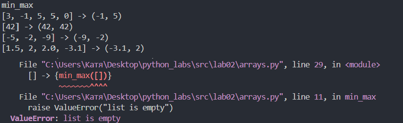
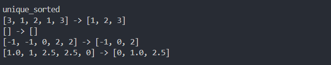
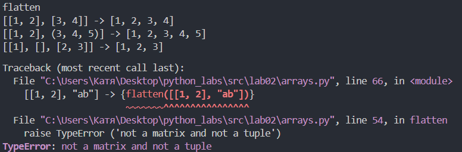
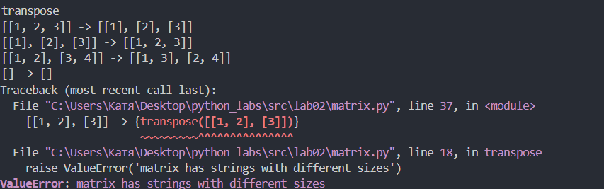
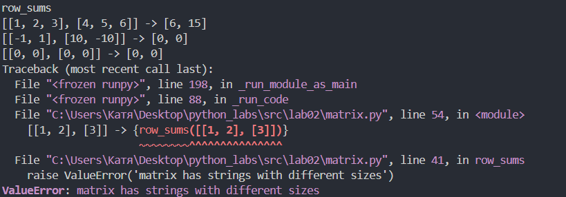
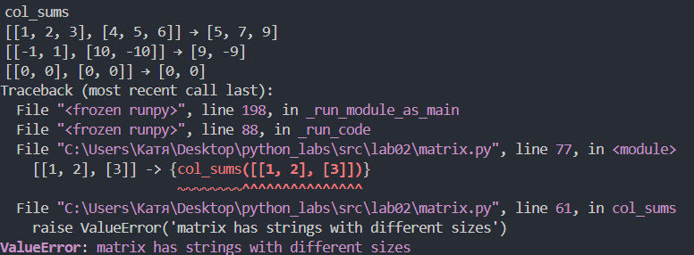

## ЛР2 — Коллекции и матрицы (list/tuple/set/dict)

### Задание 1 (arrays.py)
Программа находит минимум и максимум. Затем выводит кортеж из этих 2 значений
```py
def min_max(nums: list[float | int]) -> tuple[float | int, float | int]:
    """
    This function takes list and returns pair (min, max)

    Input data: list[float or int]
    Output data: tuple(float or int)
    Raises: ValueError(list is empty), TypeError('not a matrix')
    """

    if len(nums) == 0:
        raise ValueError("list is empty")
    if type(nums) != list and type(nums) != tuple:
        raise TypeError ('not a matrix')
    mn = 1000000500000000
    mx = -1000000000005000000
    for i in nums:
        if mn > i:
            mn = i
        if mx < i:
            mx = i
    return (mn, mx)

#Tests
print(f'''
min_max
[3, -1, 5, 5, 0] -> {min_max([3, -1, 5, 5, 0])}
[42] -> {min_max([42])}
[-5, -2, -9] -> {min_max([-5, -2, -9])}
[] -> {min_max([])} 
[1.5, 2, 2.0, -3.1] -> {min_max([1.5, 2, 2.0, -3.1])}
''')
```

<br>
*Результат выполнения функции min_max()*

### Задание 2 (arrays.py)
На вход подается список. Выводим отсортированный список без повторяющихся элементов
```py
def unique_sorted(nums: list[float | int]) -> list[float | int]:
    """
    This function sorts elements
    
    Input data: list[float or int]
    Output data: list[float or int]
    Raises: TypeError('not a matrix')
    """

    if type(nums) != list:
        raise TypeError ('not a matrix')

    nums = list(set(nums))
    for i in range(len(nums) - 1):
        for j in range(i+1, len(nums)):
            if nums[i] > nums[j]:
                nums[i], nums[j] = nums[j], nums[i]
    return nums
    

#Tests
print(f'''
unique_sorted
[3, 1, 2, 1, 3] -> {unique_sorted([3, 1, 2, 1, 3])}
[] -> {unique_sorted([])}
[-1, -1, 0, 2, 2] -> {unique_sorted([-1, -1, 0, 2, 2])}
[1.0, 1, 2.5, 2.5, 0] -> {unique_sorted([1.0, 1, 2.5, 2.5, 0])}
''')
```

<br>
*Результат выполнения функции unique_sorted()*

### Задание 3 (arrays.py)
Программа расщепляет список из списков или кортежей в один список
```py
def flatten(mat: list[list | tuple]) -> list[float | int]:
    """
    This function changes list with lists or tuples in one big list
        
    Input data: list[list or tuple]
    Output data: list[float or int]
    Raises: TypeError('not a matrix and not a tuple'), TypeError('not float and not int in list[list or tuple]')
    """

    answer = []
    for lst in mat:
        if type(lst) != list and type(lst) != tuple:
            raise TypeError ('not a matrix and not a tuple')
        for element in lst:
            answer.append(element)
    return answer


#Tests
print(f'''
flatten
[[1, 2], [3, 4]] -> {flatten([[1, 2], [3, 4]])}
[[1, 2], (3, 4, 5)] -> {flatten([[1, 2], (3, 4, 5)])}
[[1], [], [2, 3]] -> {flatten([[1], [], [2, 3]])}
[[1, 2], "ab"] -> {flatten([[1, 2], "ab"])}
''')
```

<br>
*Результат выполнения функции flatten()*

### Задание 4 (matrix.py)
Подается матрица из матриц. В выходных данных получаем транспонированную матрицу
```py
def transpose(mat: list[list[float | int]]) -> list[list]:
    """
    This function transpose matrix
    
    Input data: list[float or int]
    Output data: list[list]
    Raises: ValueError('matrix has strings with different sizes'), TypeError('not a matrix')
    """

    if len(mat) == 0:
        return []
    if type(mat) != list:
        raise TypeError('not a matrix')

    if is_matrix_same(mat) != True: 
        raise ValueError('matrix has strings with different sizes')
    t = []
    for i in range(len(mat[0])):
        t.append([0] * len(mat))

    for i in range(len(mat)):
        for j in range(len(mat[0])):
            t[j][i] = mat[i][j]
    return t

#Tests
print(f'''
transpose
[[1, 2, 3]] -> {transpose([[1, 2, 3]])}
[[1], [2], [3]] -> {transpose([[1], [2], [3]])}
[[1, 2], [3, 4]] -> {transpose([[1, 2], [3, 4]])}
[] -> {transpose([])}
[[1, 2], [3]] -> {transpose([[1, 2], [3]])}
''')
```

<br>
*Результат выполнения transpose()*

### Задание 5 (matrix.py)
На вход подается список. Выводим сумму в каждой строке списка
```py
def row_sums(mat: list[list[float | int]]) -> list[float]:
    """
    This function takes sums of strings
        
    Input data: list[float or int]
    Output data: list[float]
    Raises: ValueError('matrix has strings with different sizes'), TypeError('not a matrix')
    """
    if len(mat) == 0:
        return []
    if type(mat) != list:
        raise TypeError('not a matrix')
    if is_matrix_same(mat) != True: 
        raise ValueError('matrix has strings with different sizes')
    
    t = []
    for lst in mat:
        t.append(sum(lst))
    return t

#Tests
print(f'''
row_sums
[[1, 2, 3], [4, 5, 6]] -> {row_sums([[1, 2, 3], [4, 5, 6]])}
[[-1, 1], [10, -10]] -> {row_sums([[-1, 1], [10, -10]])}
[[0, 0], [0, 0]] -> {row_sums([[0, 0], [0, 0]])}
[[1, 2], [3]] -> {row_sums([[1, 2], [3]])}
''')
```

<br>
*Результат выполнения функции row_sums()*

### Задание 6 (matrix.py)
На вход подается список. Выводим сумму в каждом столбце списка
```py
def col_sums(mat: list[list[float | int]]) -> list[float]:
    """
    This function takes sums of columns
        
    Input data: list[float or int]
    Output data: list[float]
    Raises: ValueError('matrix has strings with different sizes'), TypeError('not a matrix')
    """
    if len(mat) == 0:
        return []
    if type(mat) != list:
        raise TypeError('not a matrix')
    if is_matrix_same(mat) != True: 
        raise ValueError('matrix has strings with different sizes')
    
    t = [0] * (len(mat[0]))

    for lst in mat:
        for i in range(len(lst)):
            t[i] += lst[i]

    return t

#Tests
print(f'''
col_sums
[[1, 2, 3], [4, 5, 6]] → {col_sums([[1, 2, 3], [4, 5, 6]])}
[[-1, 1], [10, -10]] → {col_sums([[-1, 1], [10, -10]])}
[[0, 0], [0, 0]] → {col_sums([[0, 0], [0, 0]])}
[[1, 2], [3]] -> {col_sums([[1, 2], [3]])}
''')
```

<br>
*Результат выполнения функции col_sums()*